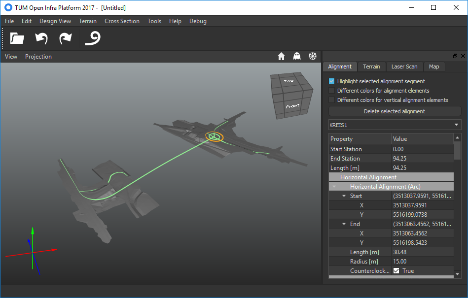

# THIS REPOSITORY IS NOT MAINTAINED ANYMORE.

Please refer to the [new repository](https://github.com/tumcms/Blue-Framework) for latest developments.

# (old) BlueFramework

## Short overview

BlueFramework is divided into different parts e.g. Core, ImageProcessing, Rasterizer, and Engine. 

The **Core** contains basic functionality for logging, vector and matrix algebra, string handling and some basic diagnostic functionality.

The **ImageProcessing** module offers basic functionality for image manipulation and loading and storing image files.

The **Rasterizer** is a thin abstract layer for graphic APIs such as Direct3D 11, Direct3D 12, OpenGL 3.x and up and Vulkan. Currently, there is a feature complete Direct3D 11 and Direct3D 12 implementation available (BlueFramework.D3D11RenderSystem, BlueFramework.D3D12RenderSystem). The OpenGL backend currently supports only a subset of the complete feature set of the Rasterizer module. The Vulkan implementation is still work in progress. As a user of the BlueFramework library, or more specifically as a user of the BlueFramework.Rasterizer module you program to an abstract interface that is internally mapped to the different render systems. This gives your application the advantage to use different graphic APIs by only writing code once.

The **Engine** module over functionality to download resources such as textures from URLs, a basic camera for first person and model view orientation, a view cube and basic resource management.

## Who is using it?

### TUM Open Infra Platform
[TUM Open Infra Platform](https://www.cms.bgu.tum.de/en/research/projects/oip)

### Ether.DebugVisualizer

[Country Kitchen](https://www.blendswap.com/blends/view/42851) scene by [Jay-Artist](https://www.blendswap.com/user/Jay-Artist)

## Documentation

[Building](Docs/Building.md)

[Deployment](Docs/Deployment.md)

[Versioning](Docs/Versioning.md)

[UnitTests](Docs/UnitTests.md)

[Rasterizer](Docs/Rasterizer.md)

## License

Copyright (c) 2016 Technical University of Munich
Chair of Computational Modeling and Simulation.

BlueFramework is free software; you can redistribute it and/or modify
it under the terms of the GNU General Public License Version 3
as published by the Free Software Foundation.

BlueFramework is distributed in the hope that it will be useful,
but WITHOUT ANY WARRANTY; without even the implied warranty of
MERCHANTABILITY or FITNESS FOR A PARTICULAR PURPOSE. See the
GNU General Public License for more details.

You should have received a copy of the GNU General Public License
along with this program. If not, see <http://www.gnu.org/licenses/>.

## Copyright notes
BlueFramework version 3.0.0.0 and up uses several software libraries. The corresponding licenses can be found in the Licenses folder distributed with this source code:

* boost 1.63.0 (http://www.boost.org/) (*Boost Software License*) ({root_dir}/Licenses/boost.LICENSE_1_0.txt)
* Eigen 3.3.3 (http://eigen.tuxfamily.org/) (*MPL2*) ({root_dir}/Licenses/Eigen.COPYING.MPL2)
* Google Test 1.8.0 (https://github.com/google/googletest) (*BSD 3-Clause License*) ({root_dir}/Licenses/GoogleTest.LICENSE)
* TinyXML-2 (https://github.com/leethomason/tinyxml2) (zlib license) ({root_dir}/Licenses/TinyXML-2.txt)
* Qt 5.9.1 (http://doc.qt.io/qt-5/lgpl.html) (LGPL version 3) ({root_dir}/Licenses/Qt.LGPL_version_3.txt)
* OGRE3D (http://www.ogre3d.org/) (MIT License) ({root_dir}/Licenses/OGRE3D.MIT.txt)
* glew 2.0.0 (http://glew.sourceforge.net/) (*Modified BSD License, the Mesa 3-D License (MIT) and the Khronos License (MIT)*) ({root_dir}/Licenses/glew.LICENSE.txt)

Some code has also been copied from the following projects:

* API DESIGN FOR C++ (http://www.apibook.com/) (MIT license) ({root_dir}/Licenses/apibook.LICENSE)
* appleseed (http://appleseedhq.net/) (MIT license) ({root_dir}/Licenses/appleseed.LICENSE.txt)
* CML (Configurable Math Library) (Boost Software License) ({root_dir}/Licenses/CML.LICENSE.txt)
* DirectX-Graphics-Samples (https://github.com/Microsoft/DirectX-Graphics-Samples) ({root_dir}/Licenses/DirectX-Graphics-Samples.LICENSE.txt)
* folly (https://github.com/facebook/folly) (Apache License Version 2.0) ({root_dir}/Licenses/folly.LICENSE.txt)
* GPUOpen-LibrariesAndSDKs/HelloD3D12 (https://github.com/GPUOpen-LibrariesAndSDKs/HelloD3D12) (BSD) ({root_dir}/Licenses/HelloD3D12.LICENSE.txt)
* Improved Console 5.0 (https://www.c-plusplus.net/code/ic/) ({root_dir}/Licenses/ic.License.txt)
* Nori Version 2 (https://github.com/wjakob/nori) (GPL v3) ({root_dir}/Licenses/Nori2.GPL_version_3.txt)
* Oryol (https://github.com/floooh/oryol) (MIT License) ({root_dir}/Licenses/Oryol.LICENSE)
* StackWalker (https://stackwalker.codeplex.com/) (New BSD License) ({root_dir}/Licenses/StackWalker.LICENSE.txt)
* tinyformat (https://github.com/c42f/tinyformat) (Boost Software License - Version 1.0) ({root_dir}/Licenses/tinyformat.LICENSE.txt)
* UtfConvert from  The LLVM Compiler Infrastructure (https://github.com/plenluno/convertutf/tree/19e1e918f4cb15bd8b61a26d00286688c6974f3b) (BSD) ({root_dir}/Licenses/LLVM_Release_License.txt)

Where appropriate the source code documents the original source.

> **Notes**

> - BlueFramwork versions 0.4.1845.* to 2.4.1077.* were developed by Julian Amann and used code derived from niven that was not licensed in a correct way. The Copyright of niven belongs to Matthäus G. Chajdas. Those copyright issues have been fixed in this version (version 3.0.0.0 and up).
> - BlueFramework version 3.0.0.0 and up is developed by the Chair of Computational Modeling and Simulation of the Technical University of Munich. It is a complete rewrite.
